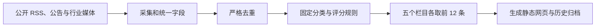

# IP 行业每日快报：纯规则版设计

## 目标

每天北京时间 09:00 生成一份个人网页电子报，用于快速观察 IP 内容行业的发展。第一版不使用 AI，以公开、可追溯的信息源和确定性规则完成筛选与排序。

## 范围

- 五个栏目：网文、短剧、漫剧、影游、AIGC。
- 中国市场信息约占 80%，海外约占 20%。
- 每个栏目最多展示 12 条；内容均可打开原始来源。
- 生成最新一期、按日期归档页、历史目录页。
- 预留重点关注清单：IP、平台、创作者。第一版只做配置与醒目标记，不改变全行业栏目。

不包含：账号体系、人工编辑后台、付费数据库、AI 摘要、全文转载、模糊语义分类。

## 信息处理流程

### 采集与标准化

每个信源在配置文件中声明：名称、URL、国家/地区、栏目、来源等级和抓取方式。采集后统一为标题、链接、发布时间、来源名、摘要、栏目、地区等字段。只保存标题和短摘要，不保存或转发原文全文。

### 分类、去重和排序

- 栏目优先以信源配置为准；只有命中明确的栏目关键词时才允许覆盖。无法确定栏目时进入运行日志，不发布。
- 去重只使用规范化链接与完全一致标题；不做相似标题猜测。
- 仅收录过去 24 小时内发布且时间可识别的条目。
- 分数由可审计的固定规则相加：来源等级、事件标签和发布时间。事件标签为预先配置的精确关键词，例如政策、融资、上线、数据、版权、获奖、合作、下架、监管。
- 按分数降序，同分按发布时间降序；每栏目最多 12 条。

## 页面与交互

- 保留参考站的报纸视觉：首页显示日期、目录、五栏摘要和重点关注；每个栏目独立报纸版面。
- 所有条目外链至原始来源；历史页按日期浏览。
- 无后端服务：浏览网页时不重新抓取、不重新计算；当天内容是静态快照。
- 单一配置文件维护信源、栏目关键词、来源等级、事件标签和重点关注对象。

## 定时与异常

- 以北京时间每天 09:00 为调度目标，采集窗口为前一日 09:00 至当日 09:00。
- 公开信源抓取失败、内容格式无效或发布时间缺失时，该信源当天不参与出报；生成结果明确列出失败来源和原因。
- 若当天某栏目没有合格条目，页面显示“今日无符合规则的动态”，不复用旧内容。
- 生成任务失败时不覆盖上一次成功的网页，并保留错误日志供排查。

## 验收条件

1. 每天可在 09:00 后访问最新网页，看到五个栏目和历史入口。
2. 每条展示内容均有来源、时间和原始链接。
3. 任一栏目不超过 12 条；发布时间不在 24 小时窗口内的内容不会进入当天快报。
4. 同一规范化链接或完全相同标题不会重复展示。
5. 失败信源和空栏目在页面上可见，不以旧数据或编造内容替代。
6. 修改配置后，无需改代码即可新增信源、关键词或重点关注对象。

## 实施边界

先实现可在本地运行的纯规则版和静态页面；公开部署和定时运行在本地验证后再配置。